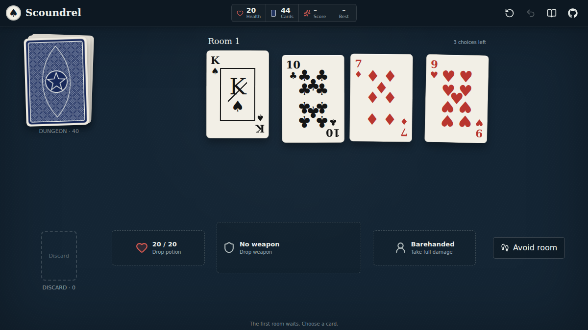

# Scoundrel PWA

An offline-first implementation of the solitaire card game Scoundrel, designed by Zach Gage and Kurt Bieg.

Play at [joelnet.github.io/scoundrel](https://joelnet.github.io/scoundrel/).



## How to Play

[](https://www.youtube.com/watch?v=Gt2tYzM93h4)

Prefer text? Read the [complete rules](./RULES.md).

## Development

```bash
npm install
npm run dev
```

Run tests and create a production build:

```bash
npm run test:run
npm run build
```

See [RULES.md](./RULES.md) for complete game rules and attribution.
